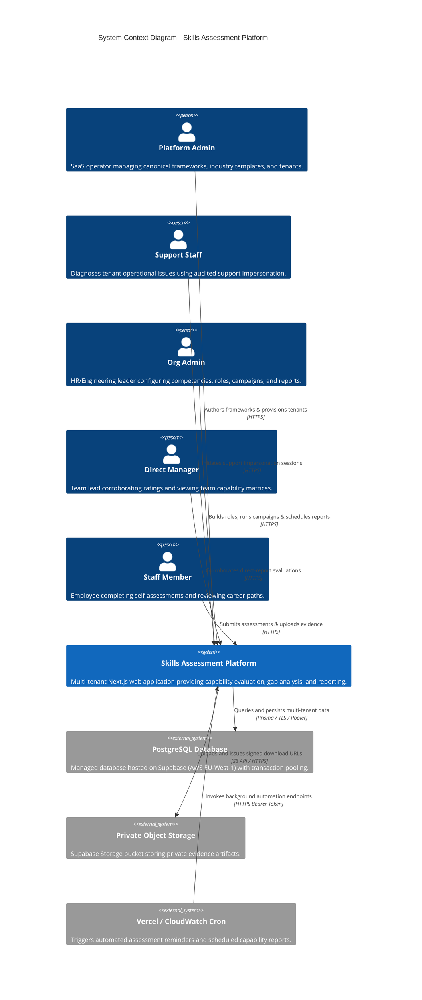
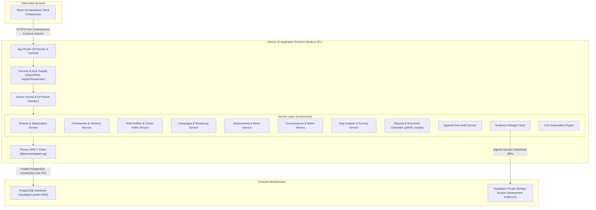
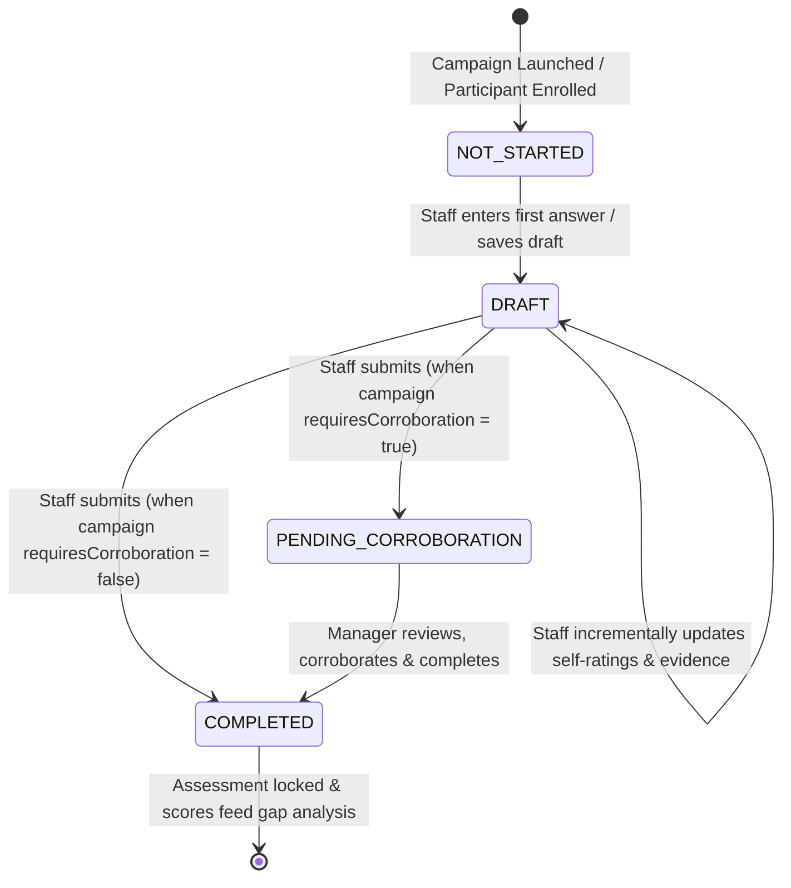
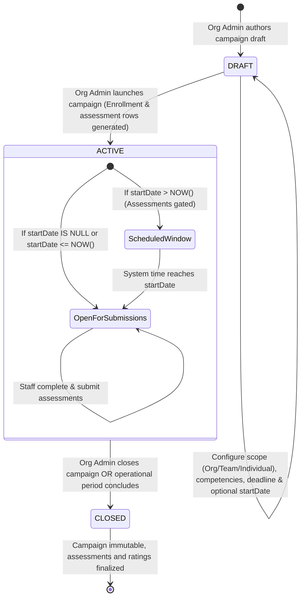
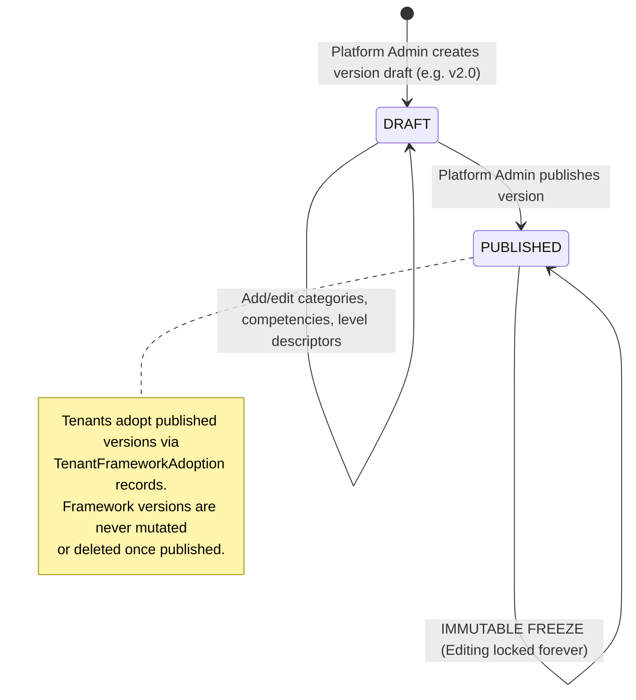
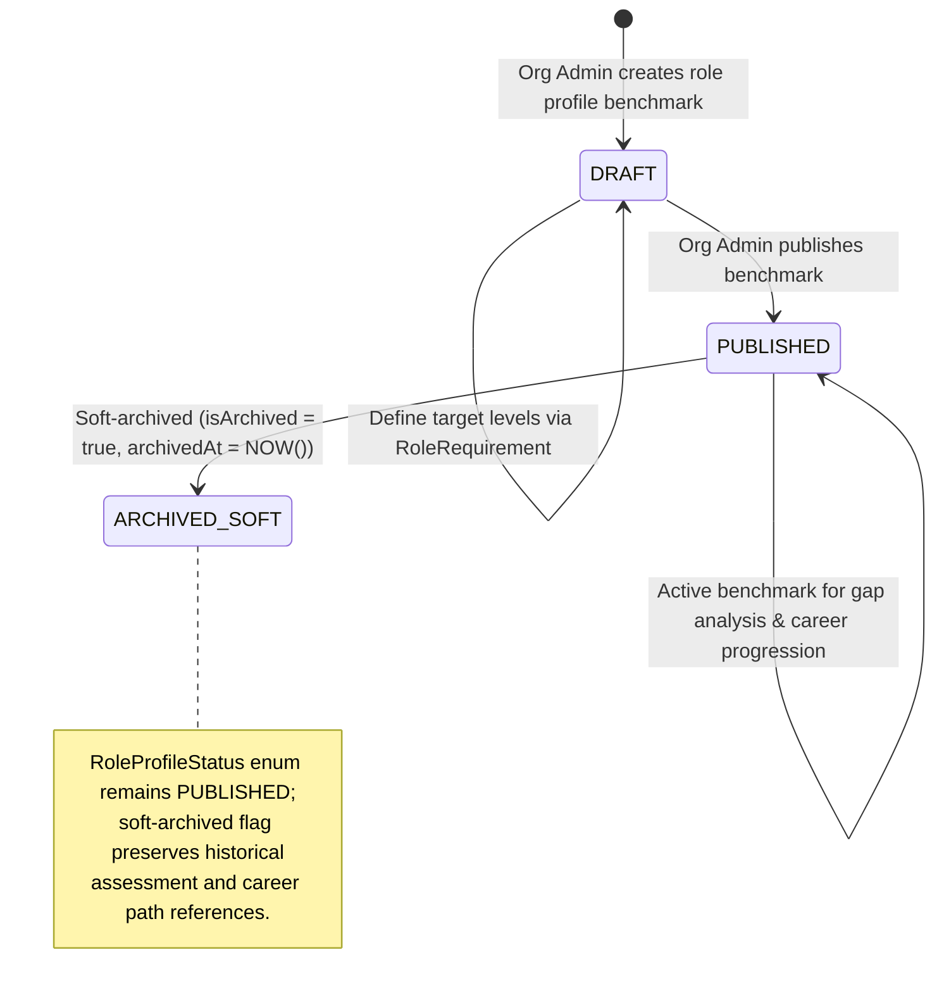
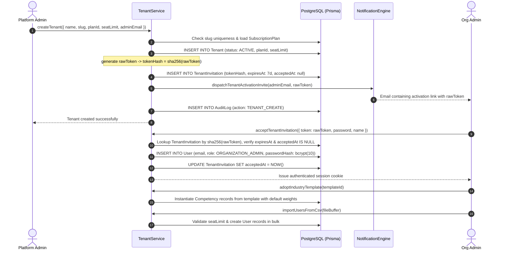
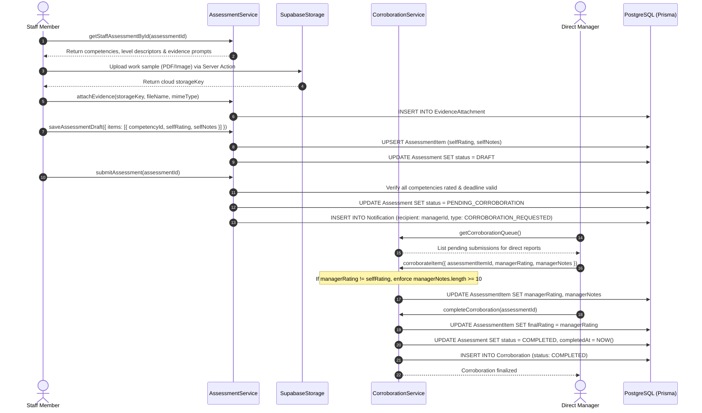
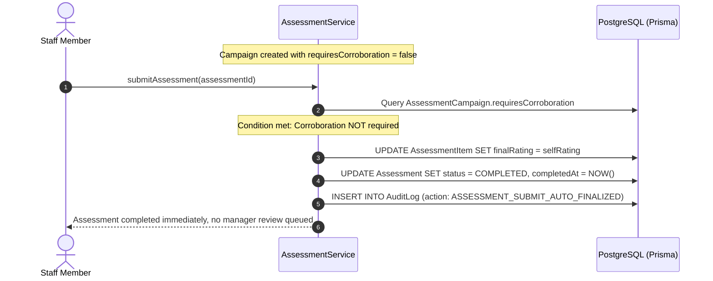
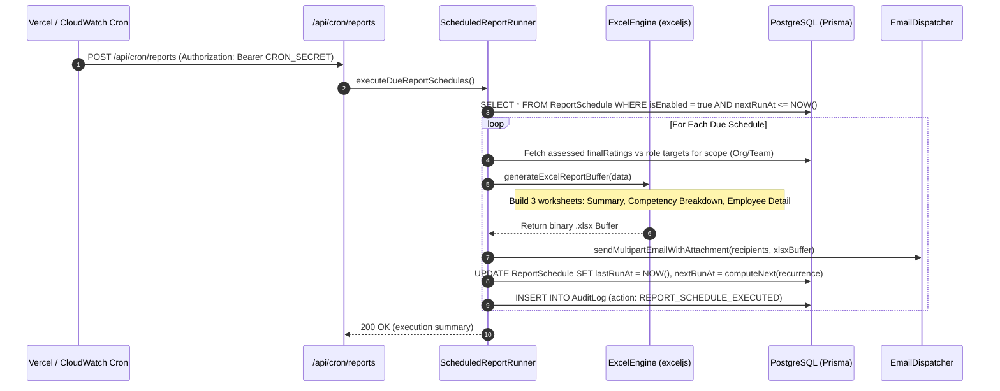

# System Architecture Blueprint

**Platform:** SFIA-Inspired Multi-Tenant Skills Assessment Platform  
**Document Type:** Architectural Blueprint, System Context, Sequence Models & ADRs  
**Version:** 1.0 (Production-Ready Architecture)  
**Target Reference:** Training Heights `BRD_SK_2`, `FRS_SK_1`, `USERST_1`  
**Related Documents:** [README.md](README.md) · [DOCUMENTATION.md](DOCUMENTATION.md)

---

## Table of Contents

1. [Architectural Overview & System Context](#1-architectural-overview--system-context)
2. [C4 Container & Component Architecture](#2-c4-container--component-architecture)
3. [Multi-Tenant Isolation & Boundary Architecture](#3-multi-tenant-isolation--boundary-architecture)
4. [State Machine Topologies](#4-state-machine-topologies)
   - [4.1 Assessment State Machine](#41-assessment-state-machine)
   - [4.2 Assessment Campaign Lifecycle](#42-assessment-campaign-lifecycle)
   - [4.3 Framework Versioning & Adoption Lifecycle](#43-framework-versioning--adoption-lifecycle)
   - [4.4 Role Profile Lifecycle & Career Path Step Progression](#44-role-profile-lifecycle--career-path-step-progression)
5. [End-to-End Sequence Diagrams](#5-end-to-end-sequence-diagrams)
   - [5.1 Tenant Provisioning & Onboarding Flow (Flow A)](#51-tenant-provisioning--onboarding-flow-flow-a)
   - [5.2 Staff Self-Assessment & Corroboration Flow (Flow D)](#52-staff-self-assessment--corroboration-flow-flow-d)
   - [5.3 Skip-Corroboration Immediate Finalization Flow (Flow E)](#53-skip-corroboration-immediate-finalization-flow-flow-e)
   - [5.4 Automated Scheduled Reporting & Cron Pipeline (Flow H)](#54-automated-scheduled-reporting--cron-pipeline-flow-h)
6. [Data Architecture & Entity-Relationship Topology](#6-data-architecture--entity-relationship-topology)
7. [Security & Cryptography Topology](#7-security--cryptography-topology)
8. [Architectural Decision Records (ADRs)](#8-architectural-decision-records-adrs)

---

## 1. Architectural Overview & System Context

The platform delivers an evidence-based competency evaluation ecosystem for multi-tenant software and engineering organizations. It bridges the gap between high-level industry frameworks (SFIA) and day-to-day talent assessment.

### System Context Diagram (C4 Level 1)



---

## 2. C4 Container & Component Architecture

### Container Diagram (C4 Level 2)



---

## 3. Multi-Tenant Isolation & Boundary Architecture

Multi-tenancy is enforced using a **Shared Database, Shared Schema with Logical Row-Level Isolation** strategy.

### Tenant Boundary Defense Model

```
┌─────────────────────────────────────────────────────────────────────────────┐
│ 1. INCOMING REQUEST                                                         │
│    Client sends HTTP request with signed HttpOnly session cookie            │
└──────────────────────────────────────┬──────────────────────────────────────┘
                                       │
                                       ▼
┌─────────────────────────────────────────────────────────────────────────────┐
│ 2. AUTHENTICATION & CONTEXT EXTRACTION (lib/auth/service.ts)                │
│    - Verifies JWT signature using HS256 (AUTH_SECRET)                       │
│    - Extracts user identity: { id, email, role, tenantId, isActive }        │
│    - Validates account status (blocks deactivated users immediately)        │
│    - Validates tenant status (blocks SUSPENDED and ARCHIVED tenants)        │
│    - CRITICAL: Client-supplied tenant IDs are NEVER trusted                 │
└──────────────────────────────────────┬──────────────────────────────────────┘
                                       │
                                       ▼
┌─────────────────────────────────────────────────────────────────────────────┐
│ 3. ROLE-BASED ACCESS GUARDS (lib/auth/guards.ts)                            │
│    - Enforces portal role boundary: requireRole(allowedRoles)               │
│    - PLATFORM_ADMIN & SUPPORT must have tenantId = null                     │
│    - ORG_ADMIN, MANAGER & STAFF must have valid tenantId != null            │
└──────────────────────────────────────┬──────────────────────────────────────┘
                                       │
                                       ▼
┌─────────────────────────────────────────────────────────────────────────────┐
│ 4. SERVICE-LAYER ISOLATION SCOPING (src/services/*)                         │
│    - Every database query mandates `where: { tenantId }`                    │
│    - Attempted queries with foreign IDs return 404 / NotFoundException     │
│    - Composite unique indexes prevent cross-tenant collisions               │
└──────────────────────────────────────┬──────────────────────────────────────┘
                                       │
                                       ▼
┌─────────────────────────────────────────────────────────────────────────────┐
│ 5. DATABASE SCHEMA COMPOSITE INDEXES (prisma/schema.prisma)                 │
│    - @@index([tenantId]) on all 26 tenant-scoped operational tables         │
│    - Foreign keys cascade-delete within tenant boundaries                   │
└─────────────────────────────────────────────────────────────────────────────┘
```

---

## 4. State Machine Topologies

### 4.1 Assessment State Machine

Every participant's evaluation record moves through a deterministic lifecycle matching `AssessmentStatus`:



### 4.2 Assessment Campaign Lifecycle

Campaign lifecycle mirrors the Prisma `CampaignStatus` enum (`DRAFT`, `ACTIVE`, `CLOSED`). Scheduled opening windows are driven by an optional `startDate`:



### 4.3 Framework Versioning & Adoption Lifecycle

Framework versioning matches the Prisma `FrameworkStatus` enum (`DRAFT`, `PUBLISHED`). Version immutability and multi-tenant adoption are managed through explicit relation models:



### 4.4 Role Profile Lifecycle & Career Path Step Progression

Role profiles and career ladders follow the exact relational models in the schema:



- **Career Path Progression**: `CareerPathStep` joins a `roleProfileId` to a `careerPathId` with `orderIndex: Int` (`@@unique([careerPathId, roleProfileId])`, `@@unique([careerPathId, orderIndex])`). Progression requirements and competency level deltas are computed dynamically by comparing sequential steps ($N$ to $N+1$) rather than storing synthetic graph edges.

---

## 5. End-to-End Sequence Diagrams

### 5.1 Tenant Provisioning & Onboarding Flow (Flow A)



### 5.2 Staff Self-Assessment & Corroboration Flow (Flow D)



### 5.3 Skip-Corroboration Immediate Finalization Flow (Flow E)



### 5.4 Automated Scheduled Reporting & Cron Pipeline (Flow H)



---

## 6. Data Architecture & Entity-Relationship Topology

The schema comprises **43 relational models** organized into four foundational clusters:

```
┌─────────────────────────────────────────────────────────────────────────────┐
│ 1. TENANCY & IDENTITY CLUSTER                                               │
│    Tenant ──< User ──< TeamMembership >── Team ──< Department              │
│      │          │                                                           │
│      │          └── (self-referencing managerId hierarchy)                  │
│      ├── SubscriptionPlan                                                   │
│      └── TenantInvitation                                                   │
└─────────────────────────────────────────────────────────────────────────────┘
                                  │
                                  ▼
┌─────────────────────────────────────────────────────────────────────────────┐
│ 2. FRAMEWORK & COMPETENCY TAXONOMY                                          │
│    FrameworkVersion ──< FrameworkCategory ──< FrameworkCompetency           │
│          │                                           │                      │
│          │                                           └──< FrameworkLevel    │
│          │                                                                  │
│    TenantFrameworkAdoption                                                  │
│          │                                                                  │
│    Competency (tenant-level, isCustom, weight) ──< CompetencyLevel          │
└─────────────────────────────────────────────────────────────────────────────┘
                                  │
                                  ▼
┌─────────────────────────────────────────────────────────────────────────────┐
│ 3. ROLES, CAREER PATHS & CAMPAIGNS                                          │
│    RoleProfile ──< RoleRequirement >── Competency                           │
│         │                                                                   │
│         └──< CareerPathStep (orderIndex) >── CareerPath                     │
│                                                                             │
│    AssessmentCampaign ──< CampaignCompetency >── Competency                 │
│         │         └──< CampaignParticipant >── User                         │
│         │         └──< CampaignTeam >── Team                                │
└─────────────────────────────────────────────────────────────────────────────┘
                                  │
                                  ▼
┌─────────────────────────────────────────────────────────────────────────────┐
│ 4. EVALUATIONS, REPORTS & EVIDENCE                                          │
│    Assessment ──< AssessmentItem ──< EvidenceAttachment                     │
│         │              │                                                    │
│         │              └── Corroboration                                    │
│         │                                                                   │
│    ReportSchedule ──< ReportScheduleRecipient                               │
│    InterviewQuestionSet ──< InterviewQuestion                               │
│    LearningResource ──< CompetencyLearningResource >── Competency           │
│    AuditLog, Notification, NotificationTemplate, IntegrationConfiguration   │
└─────────────────────────────────────────────────────────────────────────────┘
```

- **Relational Integrity & State Topologies**:
  - `RoleProfile`: Follows `RoleProfileStatus` (`DRAFT`, `PUBLISHED`) with soft-archival via `isArchived: Boolean` and `archivedAt: DateTime?`.
  - `CareerPathStep`: Joins `careerPathId` and `roleProfileId` with sequential `orderIndex: Int` (`@@unique([careerPathId, roleProfileId])`, `@@unique([careerPathId, orderIndex])`). Skill deltas are dynamically derived between consecutive steps.
  - `AssessmentCampaign`: Follows `CampaignStatus` (`DRAFT`, `ACTIVE`, `CLOSED`) with `startDate` gating opening windows.

---

## 7. Security & Cryptography Topology

```
┌─────────────────────────────────────────────────────────────────────────────┐
│                               USER CREDENTIALS                              │
│  Password  ──►  bcryptjs.hash(password, saltRounds = 10)  ──►  User.passwordHash
└─────────────────────────────────────────────────────────────────────────────┘

┌─────────────────────────────────────────────────────────────────────────────┐
│                            INVITATION & CRON TOKENS                         │
│  rawToken = crypto.randomBytes(32).toString('hex')                          │
│         │                                                                   │
│         ├──►  tokenHash = sha256(rawToken)  ──►  TenantInvitation.tokenHash │
│         │                                                                   │
│         └──►  Sent in activation email link  ──►  Never stored plaintext    │
└─────────────────────────────────────────────────────────────────────────────┘

┌─────────────────────────────────────────────────────────────────────────────┐
│                               SESSION SECURITY                              │
│  Payload { id, role, tenantId, impersonation }                              │
│         ▼                                                                   │
│  jose.SignJWT() using HS256 with 256-bit AUTH_SECRET                        │
│         ▼                                                                   │
│  HttpOnly, Secure, SameSite=Lax Cookie (Path=/, MaxAge=7d)                  │
└─────────────────────────────────────────────────────────────────────────────┘

┌─────────────────────────────────────────────────────────────────────────────┐
│                             EVIDENCE ASSET ACCESS                           │
│  Client Request  ──►  Download Gateway (/api/evidence-attachments/download) │
│                                  │                                          │
│                       Verifies session.tenantId                             │
│                                  │                                          │
│                                  ▼                                          │
│              Supabase Storage createSignedUrl(60 seconds)                   │
│                                  │                                          │
│                                  ▼                                          │
│                   Temporary Redirect (307) to Signed URL                    │
└─────────────────────────────────────────────────────────────────────────────┘

┌─────────────────────────────────────────────────────────────────────────────┐
│                         APPLICATION AUDIT SANITIZATION                      │
│  Incoming Details Payload                                                   │
│         ▼                                                                   │
│  isSensitiveKey() Filter (Checks: password, token, secret, cookie, binary)  │
│         ▼                                                                   │
│  Persisted to AuditLog with sensitive fields stripped                       │
└─────────────────────────────────────────────────────────────────────────────┘
```

---

## 8. Architectural Decision Records (ADRs)

### ADR-01: Full-Stack Next.js 16 Monolith vs. Microservices
- **Decision:** Build as a unified full-stack application using Next.js 16 App Router.
- **Rationale:** Several workflows benefit from atomic transactional guarantees across campaign launches, corroborations, and multi-tier gap reporting. A monolithic architecture eliminates distributed transaction overhead (two-phase commits), minimizes deployment complexity, and leverages React Server Components for zero-bundle-size server rendering.

### ADR-02: Server-Side Authority & Server Actions vs. Client-Side REST API
- **Decision:** Drive state mutations via Next.js Server Actions with server-enforced authentication guards (`requireTenantUser`).
- **Rationale:** Guarantees that the client browser cannot manipulate or inject `tenantId`. Every mutation runs within an isolated server execution context where session identity is verified before invoking the service layer.

### ADR-03: Shared Database, Shared Schema with Logical Isolation vs. Database-per-Tenant
- **Decision:** Implement a shared PostgreSQL database where all tables include a foreign key `tenantId`, paired with composite indexes and repository-level query scoping.
- **Rationale:** Accommodates thousands of multi-tenant accounts with minimal infrastructure overhead, permits fast cross-tenant usage analytics (`PA-07`) without distributed querying, and allows tenant provisioning (`PA-01`) to execute within sub-second response times without dynamic database migrations.

### ADR-04: Stateless JWT Cookies (`jose`) vs. Stateful Database Session Tables
- **Decision:** Issue stateless signed JWT session cookies verified using HMAC SHA-256 (`jose`).
- **Rationale:** Eliminates a database lookup on every static page or server component fetch. Account revocation is maintained by reading the user's `isActive` flag and tenant's `status` during security-critical mutations.

### ADR-05: Binary Excel Workbooks (`exceljs`) vs. Renamed CSV Files
- **Decision:** Utilize `exceljs` to generate genuine `.xlsx` binary zip workbooks complete with multiple worksheets, styled headers, and formulas.
- **Rationale:** Source requirement `OA-10` mandates Excel capability reporting. Exporting CSV files with a `.xlsx` extension triggers warnings in Microsoft Excel and fails enterprise data exchange standards.
